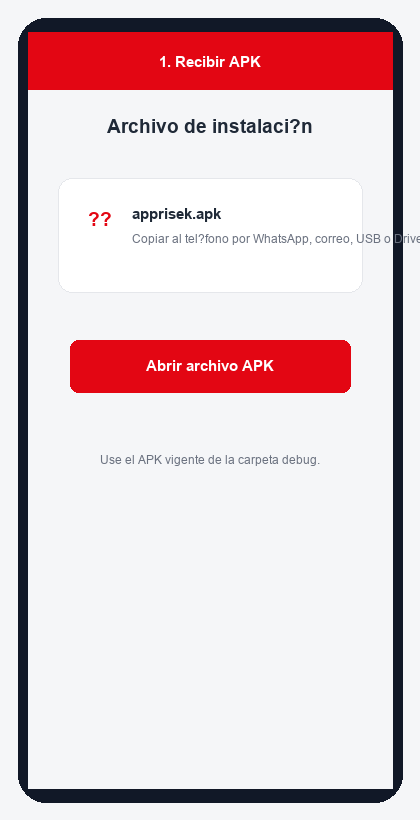
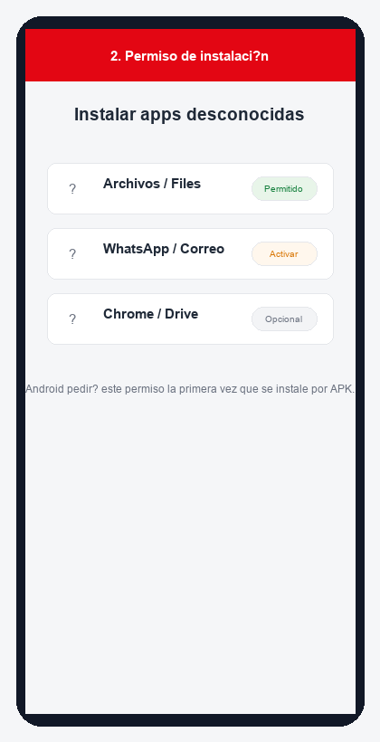
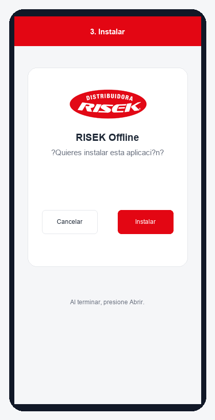
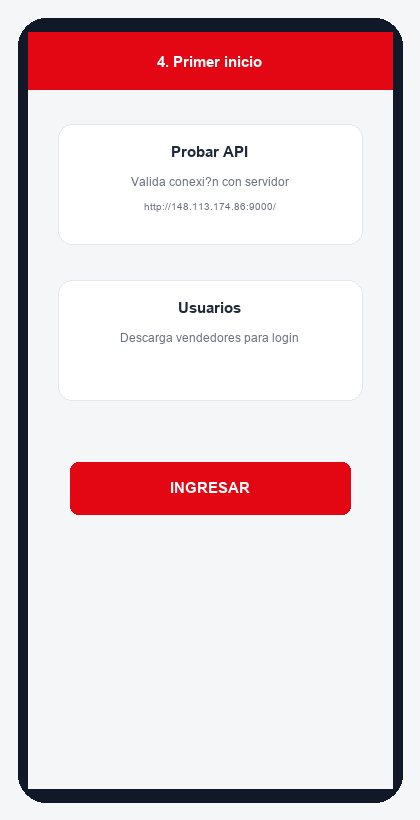
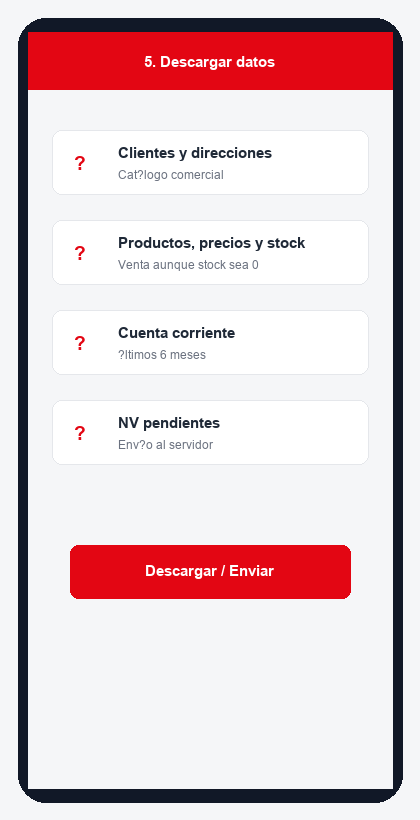
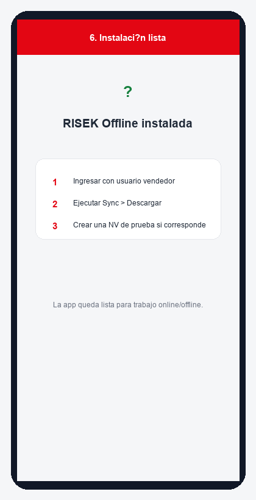

# Manual de Instalación - RISEK Offline Android

**Versión:** 1.0  
**Fecha:** 16-05-2026  
**Aplicación:** RISEK Offline Android  
**APK:** `C:\sistemas\Risekoffline\Risek_codex\android_app\app\build\outputs\apk\debug\apprisek.apk`  
**Servidor configurado:** `http://148.113.174.86:9000/`

## 1. Objetivo

Este manual explica cómo instalar la aplicación RISEK Offline en un teléfono o tablet Android usando el archivo APK. También incluye la validación inicial de conexión, descarga de usuarios y primera sincronización.

## 2. Requisitos previos

- Teléfono o tablet Android con batería suficiente.
- Archivo `apprisek.apk` vigente.
- Conexión a internet para la primera descarga de usuarios y datos.
- Permiso para instalar aplicaciones externas al Play Store.
- Usuario y contraseña asignados al vendedor.

## 3. Archivo APK

El archivo actual de instalación está en:

`C:\sistemas\Risekoffline\Risek_codex\android_app\app\build\outputs\apk\debug\apprisek.apk`

Si se comparte con el vendedor, puede enviarse por WhatsApp, correo, cable USB, Google Drive o carpeta compartida. El nombre recomendado del archivo es `apprisek.apk`.

## 4. Copiar o recibir el APK en Android

1. Envíe o copie `apprisek.apk` al teléfono.
2. Abra el archivo desde la app donde se recibió: Archivos, WhatsApp, Gmail, Drive u otra.
3. Si Android muestra advertencia de seguridad, continúe solo si el archivo fue entregado por el administrador de RISEK.

## 5. Permitir instalación desde fuente externa

Android puede mostrar el mensaje **No se permite instalar apps desconocidas** o similar.

Pasos habituales:

1. Presione **Configuración** cuando Android lo solicite.
2. Active **Permitir desde esta fuente** para la app usada para abrir el APK.
3. Vuelva atrás.
4. Presione nuevamente el archivo `apprisek.apk`.

El nombre exacto puede variar según el teléfono: Samsung, Xiaomi, Motorola, Huawei y otros fabricantes cambian levemente el texto.

## 6. Instalar la aplicación

1. Android mostrará la pantalla de instalación.
2. Presione **Instalar**.
3. Espere a que termine el proceso.
4. Presione **Abrir** para iniciar RISEK Offline.

Si aparece **Aplicación no instalada**, revise la sección de problemas frecuentes.

## 7. Primer inicio

Al abrir la app por primera vez:

1. Presione **Probar API** para validar conexión con el servidor.
2. Presione **Usuarios** para descargar vendedores disponibles.
3. Seleccione el usuario/vendedor.
4. Ingrese la contraseña.
5. Presione **INGRESAR**.

La app está configurada para conectarse a:

`http://148.113.174.86:9000/`

## 8. Primera sincronización

Después de ingresar:

1. Ir al menú **Sync**.
2. Presionar **Descargar**.
3. Esperar la descarga de clientes, direcciones, productos, familias, precios, stock, rutas y cuenta corriente.
4. Revisar el mensaje de resultado.
5. Si hay NV pendientes, presionar **Enviar NV pendientes**.

La primera sincronización puede demorar más si se descargan muchos productos o fotos.

## 9. Validación final

La instalación queda correcta cuando:

- la app abre sin errores,
- se puede seleccionar usuario,
- **Probar API** responde correctamente,
- **Sync > Descargar** finaliza sin error crítico,
- aparecen clientes y productos en la app.

## 10. Actualización de una versión existente

Para instalar una nueva versión sobre una anterior:

1. Recibir el nuevo `apprisek.apk`.
2. Abrir el APK.
3. Presionar **Actualizar** o **Instalar**.
4. Abrir la app.
5. Ejecutar **Sync > Descargar**.

No desinstale la app salvo que el administrador lo indique. Desinstalar puede borrar datos locales, incluyendo NV pendientes que aún no se hayan enviado al servidor.

## 11. Desinstalación

Solo desinstale si el administrador lo solicita.

Antes de desinstalar:

1. Entrar a **Sync**.
2. Presionar **Enviar NV pendientes**.
3. Confirmar que no queden pedidos en estado pendiente, error o eliminación pendiente.
4. Recién después desinstalar desde Ajustes de Android.

## 12. Problemas frecuentes

| Problema | Causa probable | Solución |
|---|---|---|
| No puedo abrir el APK | El archivo no terminó de descargarse | Descargar o copiar nuevamente el APK |
| Android bloquea instalación | Falta permiso de apps desconocidas | Activar **Permitir desde esta fuente** |
| Aplicación no instalada | APK corrupto, versión incompatible o firma distinta | Usar APK oficial vigente; si persiste, desinstalar solo con autorización |
| No aparecen usuarios | Sin conexión o API no disponible | Presionar **Probar API**, revisar internet y luego **Usuarios** |
| Error de conexión | Servidor no responde o red bloqueada | Validar internet y servidor `http://148.113.174.86:9000/` |
| No descargan datos | API no disponible o sesión inválida | Reingresar y ejecutar Sync nuevamente |
| No se ven fotos | API de fotos no publicada | La app funciona igual; actualizar API si se requieren fotos |
| Hay NV pendientes antes de actualizar | Pedidos sin enviar | Ejecutar **Enviar NV pendientes** antes de instalar otra versión |

## 13. Checklist para el instalador

- [ ] APK copiado al teléfono.
- [ ] Permiso de instalación externa habilitado.
- [ ] App instalada correctamente.
- [ ] API probada desde login.
- [ ] Usuarios descargados.
- [ ] Login realizado con vendedor correcto.
- [ ] Sync inicial ejecutado.
- [ ] Clientes/productos visibles.
- [ ] Vendedor informado de cómo enviar pendientes.

## 14. Soporte

Si la instalación falla, enviar al administrador:

- marca y modelo del teléfono,
- versión de Android,
- captura del mensaje de error,
- nombre del archivo APK usado,
- paso exacto donde ocurrió el problema.
