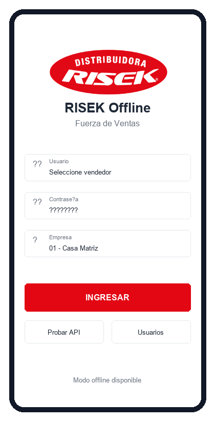
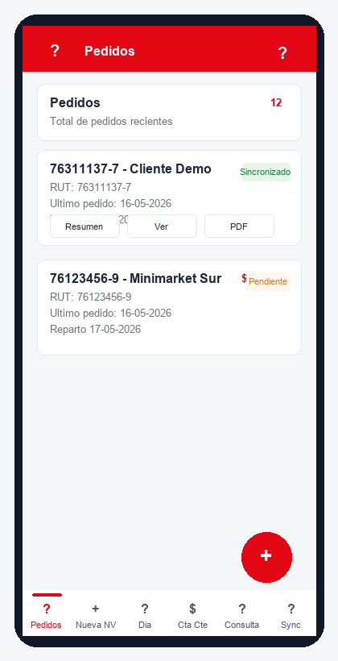
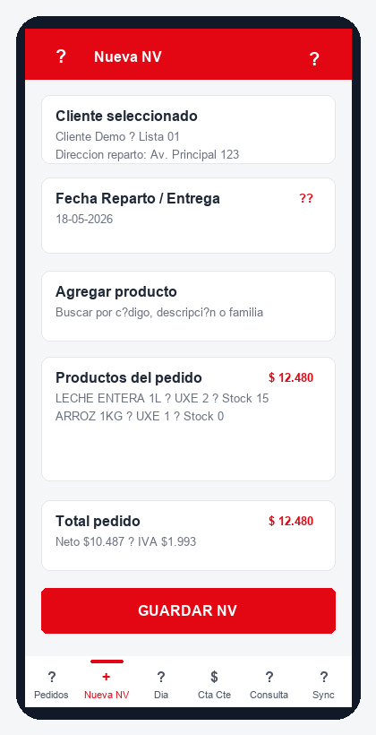
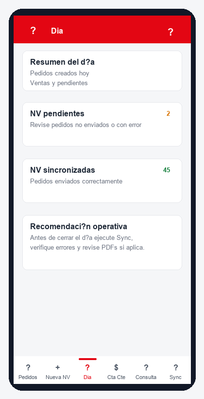
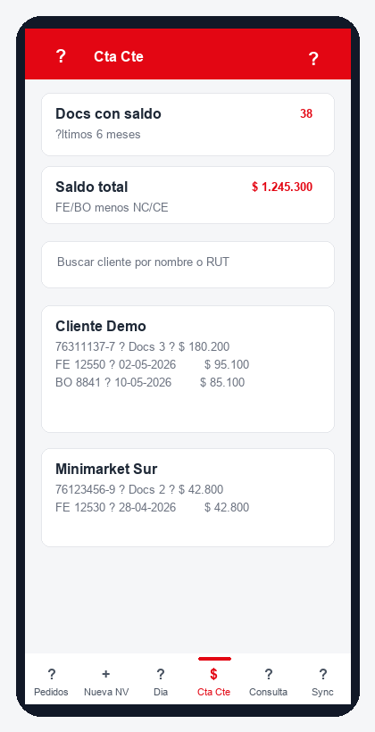
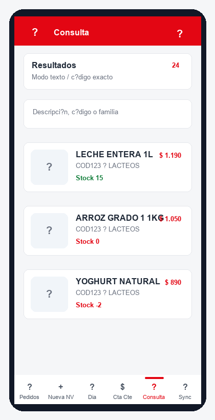
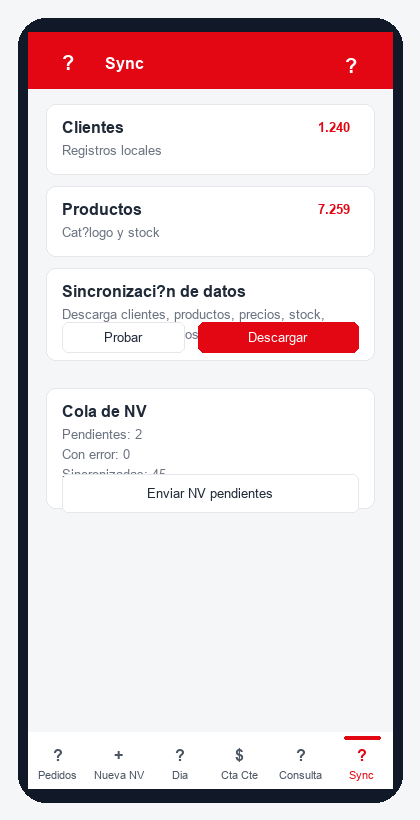

# Manual de Usuario - RISEK Offline Android

**Versión del manual:** 1.0  
**Fecha:** 16-05-2026  
**Aplicación:** RISEK Offline - Fuerza de Ventas

## 1. Objetivo de la aplicación

RISEK Offline permite al vendedor trabajar desde Android con información descargada localmente. La app permite crear notas de venta, revisar pedidos, consultar productos, stock y precios, visualizar cuenta corriente, generar PDF y sincronizar documentos con el servidor RISEK.

La aplicación está preparada para operar con conexión y también en modo offline. Cuando no hay internet, los pedidos quedan guardados localmente y se envían al servidor al ejecutar Sync o cuando vuelve la conexión.

## 2. Conceptos básicos

- **NV:** Nota de venta creada desde la app.
- **Sync:** proceso de descarga de datos maestros y envío de pedidos pendientes.
- **Pendiente:** documento guardado localmente que aún no llegó al servidor.
- **Sincronizado:** documento confirmado por el servidor con número de NV.
- **Error:** documento que no pudo enviarse; queda visible para corregir o reintentar.
- **Facturado:** documento ya convertido o bloqueado en servidor; no se puede modificar ni eliminar desde móvil.

## 3. Ingreso a la app

1. Abra la aplicación RISEK Offline.
2. Seleccione el usuario/vendedor.
3. Ingrese la contraseña.
4. Verifique la empresa/local configurado.
5. Presione **INGRESAR**.

Botones auxiliares:

- **Probar API:** valida conexión con el servidor.
- **Usuarios:** descarga o actualiza usuarios disponibles para login.

Si no hay conexión, puede trabajar con datos ya sincronizados previamente.

## 4. Menú principal

La barra inferior contiene las opciones principales:

- **Pedidos:** listado de NV locales y sincronizadas.
- **Nueva NV:** creación y edición de notas de venta.
- **Día:** resumen operativo del día.
- **Cta Cte:** cartola de cuenta corriente de clientes.
- **Consulta:** consulta de productos, precios, stock y fotos.
- **Sync:** descarga de datos y envío de pendientes.

## 5. Pedidos

En esta pantalla se revisan los pedidos recientes. Cada tarjeta muestra cliente, RUT, fecha, fecha de reparto, total y estado.

Estados habituales:

- **Pendiente:** falta enviar al servidor.
- **Sincronizado:** ya tiene número de servidor.
- **Error:** debe revisarse y reenviarse.
- **Facturado:** queda solo lectura.
- **Eliminación pendiente:** se enviará al servidor para borrar la NV.

Acciones disponibles:

- **Resumen:** vista rápida del pedido.
- **Ver:** detalle completo de cabecera y productos.
- **PDF:** genera y abre PDF de la NV.
- **Editar:** permite modificar una NV no facturada.
- **Eliminar:** elimina localmente si nunca llegó al servidor, o marca eliminación pendiente si ya existe en servidor.

Regla importante: si la NV tiene número de servidor, no se borra solo localmente; queda pendiente para eliminarse en servidor durante Sync.

## 6. Nueva NV

Use esta pantalla para crear un pedido nuevo o editar uno existente.

Flujo recomendado:

1. Buscar y seleccionar cliente.
2. Seleccionar dirección de reparto.
3. Indicar **Fecha Reparto / Entrega**.
4. Buscar productos por código, descripción o familia.
5. Ingresar UXE/cantidad solicitada.
6. Revisar stock y precio.
7. Presionar **GUARDAR NV**.

Consideraciones:

- Se puede vender aunque el producto tenga stock cero o negativo.
- La app muestra el stock como referencia, pero no bloquea la venta por falta de stock.
- La app limita la NV a 17 líneas.
- Al guardar, la NV va a Pedidos y se intenta sincronizar.
- La hora de `venta_hora` corresponde a la hora real en que se guardó la NV en la app, no a la hora posterior de sincronización.

### Edición de una NV sincronizada

Una NV sincronizada puede editarse si todavía no está facturada. Al guardar:

- conserva el mismo `offline_id`,
- conserva el número servidor,
- queda pendiente de sincronizar,
- la API actualiza la NV existente en servidor,
- si el servidor no tiene la API actualizada, la app muestra error para evitar falso éxito.

No se permite editar una NV facturada.

## 7. Día

Esta sección entrega un resumen rápido del trabajo diario: pedidos creados, pendientes, sincronizados y posibles errores. Úsela como control antes de cerrar la jornada.

Recomendación de cierre diario:

1. Entrar a **Sync**.
2. Enviar NV pendientes.
3. Revisar que no queden documentos con error.
4. Confirmar que los pedidos importantes tengan PDF o número servidor.

## 8. Cuenta corriente

La cartola se descarga en Sync y muestra documentos con saldo de los últimos 6 meses.

Incluye:

- Facturas electrónicas `FE`.
- Boletas `BO`.
- Notas de crédito `NC` y `CE`, descontando saldo.
- Solo documentos donde `venta_totalventa - venta_pagototal <> 0`.

Uso:

1. Ir a **Cta Cte**.
2. Buscar por nombre o RUT.
3. Revisar documentos y saldo por cliente.

Esta consulta está fuera de la generación de NV para que el vendedor pueda revisar deuda sin interrumpir el pedido.

## 9. Consulta de productos y precios

Permite revisar catálogo de productos, código, familia, precio, stock y foto cuando está disponible.

Modos de búsqueda:

- **Texto:** busca por descripción, código o familia.
- **Código exacto:** útil para escáner o digitación precisa.

Datos mostrados:

- Foto del producto o ícono genérico.
- Descripción.
- Código y familia.
- Stock actual.
- Precio de venta.

Nota sobre fotos: la sincronización de fotos depende de que el servidor tenga publicada la ruta de fotos. Si el servidor aún no tiene esa API, la app funciona igual y muestra un ícono de producto.

## 10. Sync

Sync concentra dos procesos: descarga de datos y envío de NV.

### Descargar datos

Presione **Descargar** para actualizar:

- usuarios,
- clientes,
- direcciones de reparto,
- productos,
- familias,
- precios,
- rutas,
- stock,
- cuenta corriente,
- fotos de productos si la API está disponible.

### Enviar NV pendientes

Presione **Enviar NV pendientes** para enviar:

- NV nuevas,
- NV editadas,
- eliminaciones pendientes.

Si una NV falla, queda en estado **Error** con mensaje visible en Pedidos y puede reenviarse luego.

## 11. Operación offline

La app puede trabajar sin internet con la última información descargada. En modo offline:

- se pueden crear NV,
- se pueden consultar productos ya descargados,
- se puede revisar cuenta corriente descargada,
- los pedidos quedan pendientes,
- al volver la conexión se envían desde Sync.

Buenas prácticas:

- Sincronizar al inicio del día.
- Sincronizar antes de terminar la jornada.
- Revisar errores antes de salir.
- Evitar editar pedidos ya facturados en el sistema central.

## 12. Reglas comerciales implementadas

- Cliente bloqueado no puede vender.
- Dirección de reparto obligatoria.
- Fecha de reparto obligatoria.
- Máximo 17 líneas por NV.
- Stock visible, pero no bloqueante.
- `venta_kilos` se calcula según gramaje:
  - si `producto_gramaje > 0`: `venta_kilos = venta_cantidad * (venta_unidadenvase * producto_gramaje)`;
  - si no: `venta_kilos = venta_cantidad`.
- NV facturada no se modifica ni elimina desde móvil.
- NV con número servidor se elimina en servidor, no solo localmente.

## 13. Errores frecuentes y solución

| Mensaje / situación | Causa probable | Acción recomendada |
|---|---|---|
| Error descargando fotos 404 | Servidor remoto sin endpoint de fotos | Actualizar/reiniciar API; la app sigue funcionando sin fotos |
| Servidor no aplicó edición | API remota antigua | Publicar la API actualizada y reenviar Sync |
| Cliente bloqueado | Cliente con estado `B` | Revisar cliente en RISEK central |
| Debe seleccionar dirección | Falta dirección de reparto | Seleccionar dirección antes de agregar productos |
| NV facturada | Documento bloqueado por facturación | No editar; crear nuevo documento si corresponde |
| NV queda pendiente | Sin conexión o servidor no disponible | Reintentar desde Sync |
| NV con error | Validación o problema servidor | Leer mensaje en Pedidos, corregir y reenviar |

## 14. Recomendación para el vendedor

Al iniciar el día:

1. Abrir app.
2. Probar API.
3. Ejecutar **Sync > Descargar**.
4. Confirmar que productos, precios y clientes están cargados.

Durante la venta:

1. Crear NV.
2. Revisar fecha de reparto.
3. Validar total.
4. Guardar.
5. Confirmar estado en Pedidos.

Al terminar el día:

1. Ir a **Sync**.
2. Enviar pendientes.
3. Revisar Pedidos con error.
4. Confirmar que no queden eliminaciones pendientes.

## 15. Soporte

Para soporte, enviar al administrador:

- nombre del vendedor,
- cliente/RUT,
- número servidor si existe,
- fecha y hora del problema,
- captura de pantalla del error,
- estado visible en Pedidos.

